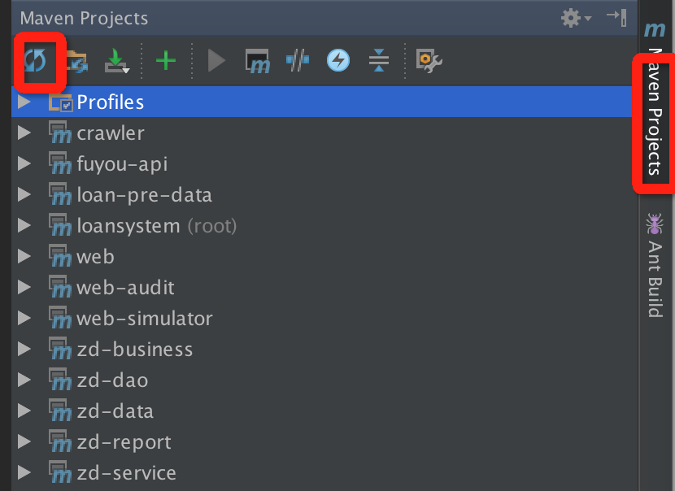

## 导出svn上的maven工程
1. ld 
2. 代码checkout到本地后，查看代码发现都有红色的问号（表示有错误）。这是因为Intellij没有自动刷新导致的。只要点击Intellij右侧MavenProjects，再点击刷新图标即可。



# Intellij常用快捷键

组合键  | 实现的功能
------------- | -------------
```cmd + R```  | 替换
```cmd + F```  | 查找
```alt + F7```  | 查找方法或者类被引用的地方
```cmd + shift + F```  | 全工程搜索某字符串内容
```cmd + N```  | 生成构造方法或者getter/setter

