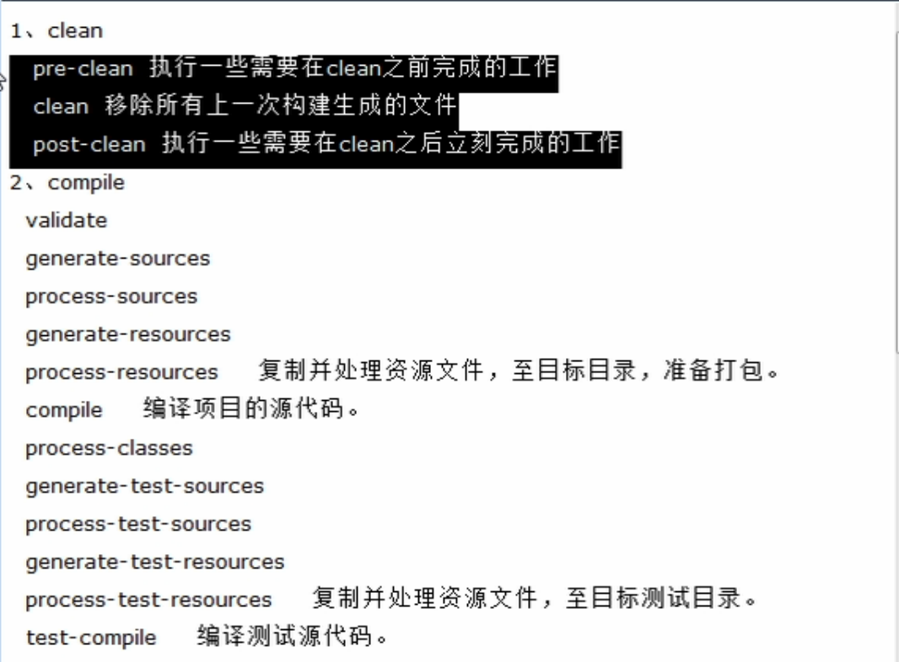
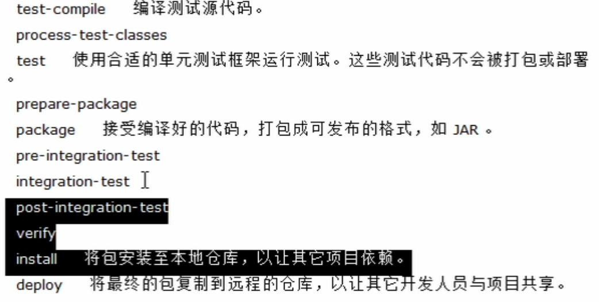
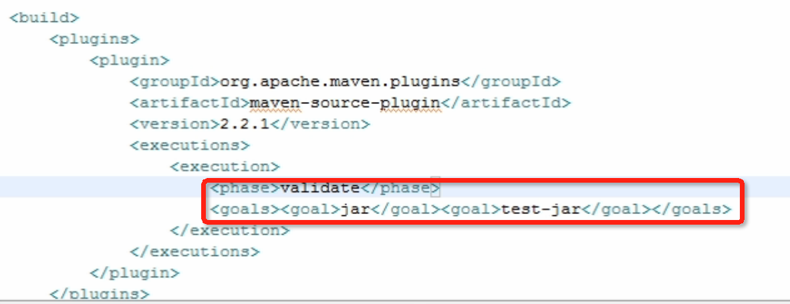

## maven主要命令

### 安装但不运行test代码
```
$ mvn clean install -Dmaven.test.skip=true
```

### 指定profile安装
```
$ mvn clean install -Pint	# 给测试发的版本
```

```
$ mvn clean install -Pdev	# 给开发发的版本
```

### 指定profile，不运行test（合并）
```
$ mvn clean install -Pint -Dmaven.test.skip=true
```

## maven聚合
假设有projectA，它里面聚合了projectB、projectC两个模块，projectA的pom.xml中的`<packaging>`属性值必须为pom。

```
<packaging>pom</packaging>

```


# Maven参数配置

## packaging 打包类型

任何一个maven工程，对应有一个pom.xml文件。这个pom.xml文件通过```<packaging>xxx</packaging>```来决定该工程打包的类型（打成jar包？war包？）。

- 不填时（默认），表示打成jar包。
- war，表示打成war包。
- pom，表示这个工程不打包，它是其它工程的父工程。


# Nexus相关

Nexus安装之后，会自动配置下面这几个仓库。如图：

**图片**

这里面的仓库主要有三种类型： ```hosted```|```proxy```|```group```

**hosted**: 主要与公司内部打交道。例如用户发布包（```mvn deploy```）就会将包上传到```hosted```类别的仓库中。

- Releases仓库：当工程pom的version为x.x.x-Release时，用户发布后会将包上传到该仓库。
- Snapshots仓库：与上逻辑同。
- 3rd part仓库：如果有些依赖包在maven的中央仓库找不到，就需要到该依赖包的官网下载，让后将依赖包上传到该仓库中。用户下次添加依赖时，会直接到该仓库获取。

**proxy**: 主要与外网打交道。

- Centeral仓库：从maven中央仓库下载的包都放在该仓库。
- Apache Snapshots仓库：放从apache下载的包。
- Codehause Snapshots仓库：放从codehause下载的包。

**设置mirror后，工程只会访问镜像，如果程序访问不了镜像，也不会去访问中央工厂回到家后，无法访问mirror时，就需要注释mirror，程序才会去中央工厂下载**

## 发布（mvn deploy）

要将包发布到私服上，需要先在pom中设置```<distributionManagement>```和```<server>```

**图片1**

**pic2**

## Maven的生命周期
**有3套生命周期：clean的生命周期、compile的生命周期、site的生命周期**

下图列出了执行mvn clean和mvn install需要完成的步骤。





## 插件的配置

表示在执行完validate之后，就会执行jar和test-jar操作。



**在父级pom中，有```<pluginsManagement>```|```<dependencyManagement>```标签，在它里面定义的内容不能够被子模块直接继承，需要在子模块中手动添加groupid和archtypeId才行**


